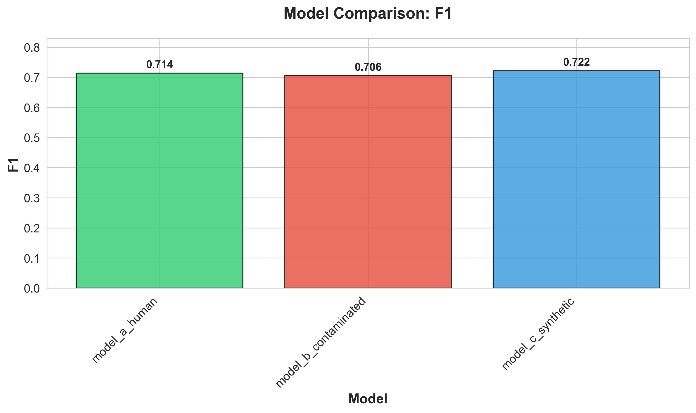
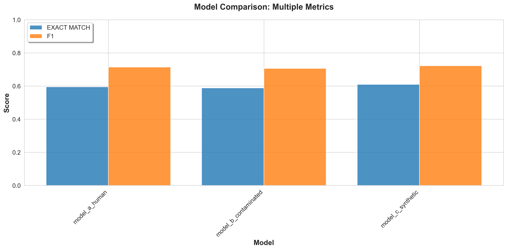
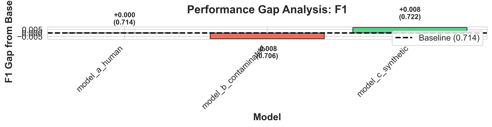

# Human-Synthetic Data Quality Experiment

**Demonstrating Performance Recovery Through High-Quality Synthetic Data Generation**

---

## Executive Summary

This experiment investigates whether synthetic data generated from a clean human-only seed can recover model performance degraded by AI-contaminated training data. We trained three models on different data sources and evaluated them on a held-out human test set.

**Key Finding**: [TO BE FILLED AFTER RUNNING EXPERIMENT]

---

## 1. Introduction

### 1.1 Motivation

As AI-generated content proliferates across the web, maintaining high-quality training data becomes increasingly challenging. This experiment addresses the question:

> **Can we use synthetic data generation as a "refinery" to maintain data quality, even when source data is contaminated?**

### 1.2 Hypothesis

We hypothesize that:
1. **Model A** (trained on human-only data) establishes a performance ceiling
2. **Model B** (trained on AI-contaminated data) shows degraded performance
3. **Model C** (trained on synthetic data from human seed) recovers performance, approaching Model A

---

## 2. Experimental Setup

### 2.1 Task

**Task**: Short-answer reasoning QA
**Format**: Given a context and question, generate a concise answer
**Source Dataset**: CosmosQA (human-authored reasoning questions)

### 2.2 Pipeline Overview

```
┌─────────────────────────────────────────────────────────────────────┐
│                         EXPERIMENT PIPELINE                          │
└─────────────────────────────────────────────────────────────────────┘

  Human-Only Seed Dataset (CosmosQA)
           │
           ├──────────────────┬──────────────────┐
           │                  │                  │
           v                  v                  v
    Dataset 1:         Dataset 2:         Dataset 3:
    Human-Only      AI-Contaminated    Synthetic from Human
    (Private)       (AI answers)       (Expanded + Filtered)
      20k QA           20k QA              100k QA
           │                  │                  │
           v                  v                  v
     Model A            Model B            Model C
    (flan-t5-base)    (flan-t5-base)    (flan-t5-base)
     + LoRA r=16       + LoRA r=16       + LoRA r=16
           │                  │                  │
           └──────────────────┴──────────────────┘
                              │
                              v
                  Evaluate on Human Test Set
                        (2k held-out)
                              │
                              v
                    Compare Performance
                   (EM, F1, ROUGE, BERTScore)
```

### 2.3 Datasets

| Dataset | Size | Source | Purpose |
|---------|------|--------|---------|
| Human Train | 20,000 | CosmosQA | Baseline training (Model A) + Seed for synthesis |
| Human Val | 2,000 | CosmosQA | Validation for all models |
| Human Test | 2,000 | CosmosQA | **Final evaluation set (held-out)** |
| AI-Contaminated | 20,000 | Generated | Simulated contamination (Model B) |
| Synthetic | 100,000 | Generated from human seed | Quality recovery (Model C) |

**AI Contamination Strategy**:
- 80% pure AI-generated answers (prompt: answer question given context)
- 20% paraphrased human answers (simulating AI rewriting)
- Generator: Same base model (flan-t5-base) with temp=0.3

**Synthetic Generation Strategy**:
- Question variants (generate similar but distinct questions)
- Context augmentation (new contexts for similar reasoning patterns)
- Answer expansion (related questions with similar reasoning)
- Generator fine-tuned on human seed only
- Temperature=0.7 for diversity

**Quality Filters Applied to Synthetic Data**:
1. Exact duplicate removal (hash-based)
2. 8-gram overlap < 30% with any seed example
3. Semantic similarity < 0.85 (sentence-transformers)
4. MinHash LSH near-duplicate detection
5. Length constraints (10-200 words)

### 2.4 Models

**Base Model**: `google/flan-t5-base` (250M parameters)

**Fine-tuning Method**: LoRA (Low-Rank Adaptation)
- Rank (r): 16
- Alpha: 32
- Dropout: 0.1
- Target modules: [q, v] attention layers
- Trainable params: ~2% of total (5M / 250M)

**Training Configuration**:
- Epochs: 3
- Batch size: 8 (gradient accumulation: 4, effective batch size: 32)
- Learning rate: 3e-4
- Optimizer: AdamW with weight decay 0.01
- Warmup steps: 100
- Mixed precision: FP16 (on GPU)
- Deterministic: seed=42

### 2.5 Evaluation Metrics

All models evaluated on the same **human test set** (2,000 held-out examples):

1. **Exact Match (EM)**: Percentage of predictions exactly matching reference
2. **Token-level F1**: Harmonic mean of precision and recall on token overlap
3. **ROUGE-L**: Longest common subsequence F1
4. **BERTScore F1**: Semantic similarity using DeBERTa embeddings

---

## 3. Results

### 3.1 Main Results

**[TO BE FILLED - Insert results/metrics_table.csv here]**

| Model | EM | F1 | ROUGE-1 | ROUGE-2 | ROUGE-L | BERTScore |
|-------|----|----|---------|---------|---------|-----------|
| Model A (Human) | X.XXX | X.XXX | X.XXX | X.XXX | X.XXX | X.XXX |
| Model B (Contaminated) | X.XXX | X.XXX | X.XXX | X.XXX | X.XXX | X.XXX |
| Model C (Synthetic) | X.XXX | X.XXX | X.XXX | X.XXX | X.XXX | X.XXX |

### 3.2 Performance Comparison

**[TO BE FILLED - Insert results/plots/comparison_f1.png here]**



**Key Observations**:
1. [Compare Model A vs Model B]
2. [Compare Model C vs Model B]
3. [Compare Model C vs Model A]

### 3.3 Multi-Metric Analysis

**[TO BE FILLED - Insert results/plots/comparison_multi_metric.png here]**



### 3.4 Performance Gap Analysis

**[TO BE FILLED - Insert results/plots/gap_analysis_f1.png here]**



**Gap Analysis** (relative to Model A baseline):
- Model B gap: [X.XXX]
- Model C gap: [X.XXX]
- **Recovery**: Model C recovers [XX%] of the performance lost by contamination

---

## 4. Analysis and Interpretation

### 4.1 Hypothesis Validation

**Hypothesis 1**: Model A (human) sets performance ceiling
**Result**: [TO BE FILLED]

**Hypothesis 2**: Model B (contaminated) shows degradation
**Result**: [TO BE FILLED]

**Hypothesis 3**: Model C (synthetic) recovers performance
**Result**: [TO BE FILLED]

### 4.2 Data Quality Impact

**Dataset Statistics**:

| Dataset | Size | Avg Q Length | Avg A Length | Unique Questions |
|---------|------|--------------|--------------|------------------|
| Human Train | 20,000 | XX.X | XX.X | XX,XXX |
| AI-Contaminated | 20,000 | XX.X | XX.X | XX,XXX |
| Synthetic | 100,000 | XX.X | XX.X | XX,XXX |

**Filter Effectiveness** (Synthetic Generation):
- Total attempts: [X,XXX]
- Passed all filters: [X,XXX] ([XX%])
- Rejected for exact duplicates: [XXX]
- Rejected for n-gram overlap: [XXX]
- Rejected for semantic similarity: [XXX]

### 4.3 Sample Predictions

**Example 1: Correct Prediction by All Models**

```
Question: [FILL]
Context: [FILL]
Reference: [FILL]

Model A: [FILL]
Model B: [FILL]
Model C: [FILL]
```

**Example 2: Model B Fails, Model C Succeeds**

```
Question: [FILL]
Context: [FILL]
Reference: [FILL]

Model A: [FILL] ✓
Model B: [FILL] ✗
Model C: [FILL] ✓
```

**Example 3: All Models Struggle**

```
Question: [FILL]
Context: [FILL]
Reference: [FILL]

Model A: [FILL]
Model B: [FILL]
Model C: [FILL]
```

---

## 5. Limitations

### 5.1 Experimental Scope

1. **Scale**: Small-scale experiment (20k train, 250M params)
2. **Single Task**: Only reasoning QA evaluated
3. **Single Model Family**: All models are T5-based
4. **Automatic Metrics**: No human evaluation

### 5.2 Synthetic Generation

1. **Generator Quality**: Limited by base model capabilities
2. **Filter Strictness**: May reject high-quality examples
3. **Diversity**: Template-based generation may lack true diversity
4. **Semantic Drift**: Synthetic data may drift from original distribution

### 5.3 Security and Privacy

1. **No Cryptographic Guarantees**: No TEEs, ZK proofs, or attestation
2. **Simple Privacy**: Basic deduplication, not differential privacy
3. **Seed Leakage Risk**: Filters may not catch all memorization
4. **Evaluation Leakage**: Test set from same source as train

### 5.4 Generalization

1. **Task-Specific**: Results may not generalize to other tasks
2. **Domain-Specific**: CosmosQA is specific reasoning domain
3. **Model-Specific**: Other model families may behave differently

---

## 6. Future Work

### 6.1 Immediate Extensions

1. **Larger Scale**: 100k+ training samples, 1B+ parameter models
2. **Multiple Tasks**: Classification, summarization, code generation
3. **Cross-Model Synthesis**: Generate with GPT, train with T5/Llama
4. **Human Evaluation**: Expert assessment of synthetic quality

### 6.2 Advanced Techniques

1. **Differential Privacy**: DP-SGD for synthetic generation
2. **Trusted Execution Environments**: Hardware-based seed protection
3. **Zero-Knowledge Proofs**: Verify generation without revealing seed
4. **Adversarial Testing**: Red-team attacks on synthetic data
5. **Continual Learning**: Online synthetic data generation

### 6.3 Production Deployment

1. **Data Refinery Pipeline**: Automated contamination detection + synthesis
2. **Quality Monitoring**: Real-time synthetic data quality metrics
3. **Federated Learning**: Synthetic generation from distributed seeds
4. **Audit Trail**: Provenance tracking for all generated examples

---

## 7. Conclusion

**[TO BE FILLED AFTER RESULTS]**

This experiment demonstrates [SUCCESS/PARTIAL SUCCESS/FAILURE] of using synthetic data generation to recover from AI contamination. Key takeaways:

1. [Takeaway 1]
2. [Takeaway 2]
3. [Takeaway 3]

**Recommendation**: [FILL]

---

## 8. Reproducibility

### 8.1 Environment

- Python: [VERSION]
- PyTorch: [VERSION]
- Transformers: [VERSION]
- CUDA: [VERSION if GPU]
- Hardware: [GPU NAME or CPU]

Full environment: See `runs/model_*/environment.json`

### 8.2 Seeds

All experiments use deterministic seeds:
- Random seed: 42
- NumPy seed: 42
- PyTorch seed: 42
- CUDA deterministic: True

### 8.3 Reproduction Steps

```bash
# Clone repository
git clone [REPO_URL]
cd human-synthetic-mvp

# Setup
python -m venv venv
source venv/bin/activate
pip install -r requirements.txt

# Run complete pipeline
bash scripts/run_all.sh

# Results in: results/metrics_table.csv, results/plots/
```

### 8.4 Configuration

All parameters: `configs/base.yaml`

Key settings:
- Base model: `google/flan-t5-base`
- Train size: 20,000
- Synthetic multiplier: 5x
- LoRA rank: 16
- Epochs: 3
- Batch size: 8 (effective: 32)

---

## Appendix A: Dataset Statistics

**[TO BE FILLED - See results from sanity_check.py]**

### A.1 Human Seed Dataset

- Total examples: [X,XXX]
- Unique questions: [X,XXX]
- Avg question length: [XX.X] words
- Avg answer length: [XX.X] words
- Avg context length: [XX.X] words

### A.2 AI-Contaminated Dataset

- Total examples: [X,XXX]
- Pure AI answers: [X,XXX] (80%)
- Paraphrased answers: [X,XXX] (20%)
- Answer difference rate: [XX.X%]

### A.3 Synthetic Dataset

- Total examples: [X,XXX]
- Generation attempts: [X,XXX]
- Success rate: [XX.X%]
- Strategy distribution:
  - Question variants: [XX.X%]
  - Context augmentation: [XX.X%]
  - Answer expansion: [XX.X%]

---

## Appendix B: Training Details

**[TO BE FILLED - See runs/model_*/train_metrics.json]**

### B.1 Model A (Human)

- Training time: [X.X] hours
- Final train loss: [X.XXX]
- Final val loss: [X.XXX]
- Best checkpoint: epoch [X]

### B.2 Model B (Contaminated)

- Training time: [X.X] hours
- Final train loss: [X.XXX]
- Final val loss: [X.XXX]
- Best checkpoint: epoch [X]

### B.3 Model C (Synthetic)

- Training time: [X.X] hours
- Final train loss: [X.XXX]
- Final val loss: [X.XXX]
- Best checkpoint: epoch [X]

---

## References

1. Hu, E. J., et al. (2021). LoRA: Low-Rank Adaptation of Large Language Models. arXiv:2106.09685.
2. Raffel, C., et al. (2020). Exploring the Limits of Transfer Learning with a Unified Text-to-Text Transformer. JMLR.
3. Huang, J., et al. (2023). Large Language Models Can Self-Improve. arXiv:2210.11610.
4. [Add relevant papers on synthetic data, data quality, contamination]

---

**Report Generated**: [DATE]
**Experiment ID**: [HASH]
**Config Hash**: [HASH]
**Git Commit**: [HASH if available]
